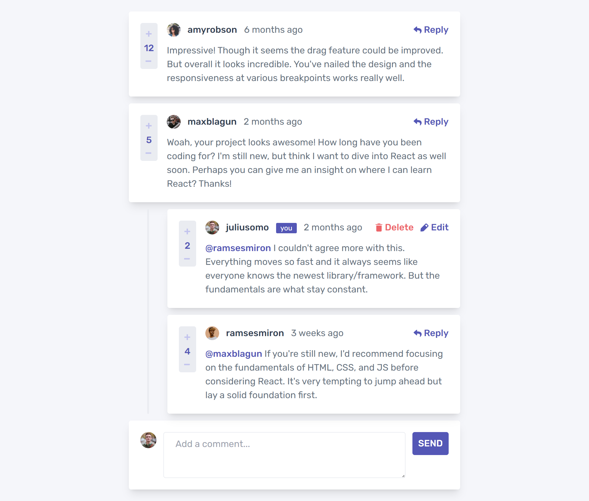

# Frontend Mentor - Interactive comments section solution

This is a solution to the [Interactive comments section challenge on Frontend Mentor](https://www.frontendmentor.io/challenges/interactive-comments-section-iG1RugEG9). Frontend Mentor challenges help you improve your coding skills by building realistic projects. 

## Table of contents

- [Overview](#overview)
  - [The challenge](#the-challenge)
  - [Screenshot](#screenshot)
  - [Links](#links)
- [My process](#my-process)
  - [Built with](#built-with)
  - [What I learned](#what-i-learned)
  - [Continued development](#continued-development)
  - [Useful resources](#useful-resources)
- [Author](#author)
- [Acknowledgments](#acknowledgments)

## Overview

### The challenge

Users should be able to:

- View the optimal layout for the app depending on their device's screen size
- See hover states for all interactive elements on the page
- Create, Read, Update, and Delete comments and replies
- Upvote and downvote comments
- **Bonus**: If you're building a purely front-end project, use `localStorage` to save the current state in the browser that persists when the browser is refreshed.
- **Bonus**: Instead of using the `createdAt` strings from the `data.json` file, try using timestamps and dynamically track the time since the comment or reply was posted.

### Screenshot



### Links

- Solution URL: [Project Repo](https://github.com/goody-dev/interactive-comment-section)
- Live Site URL: [Web Page](https://interactive-comment-section-gy.vercel.app)

## My process

### Built with

- Semantic HTML5 markup
- CSS custom properties
- Flexbox
- localStorage - to save states in the browser
- Mobile-first workflow
- [immerjs](https://immerjs.github.io) - A tiny package that allows you to work with immutable state in a more convenient way
- [React Timestamp](https://www.npmjs.com/react-timestamp) - A React Component for displaying a datetime in local timezone
- [React](https://reactjs.org/) - JS library
- [TailwindCSS](https://tailwindcss.com) - CSS framework

### What I learned

I gained experience working with react's useReducer hook and immer.js combined
I also learnt how to use the react-timestamp component.

```js
const findComment = (comments, commentId, nestKey) => {
    for(const key in comments) {
        const comment = comments[key];

        if(comment.id === commentId) {
            return comment;
        }
        if(comment[nestKey] && comment[nestKey].length !== 0) {
            const foundReply = findComment(comment[nestKey], commentId, nestKey);
            if(foundReply) {
                return foundReply;
            }
        }
    }
    return null;
}
```

### Continued development

I would like to improve my problem solving skills and build more complex components in the future!

### Useful resources

- [React Documentation](https://www.react.dev) - I worked with the react documentation while building, it helped better my understanding of some concepts.
- [Tailwind Documentation](https://www.tailwindcss.com) - I used it in learning styling based on variables, or conditional tailwind styling if you will.

## Author

- Website - [Goodness Okanlawon](https://www.goodness.vercel.app)
- Frontend Mentor - [@yourusername](https://www.frontendmentor.io/profile/yourusername)
- Twitter - [@goody_dev](https://www.twitter.com/goody_dev)

## Acknowledgments

Thanks to God!
